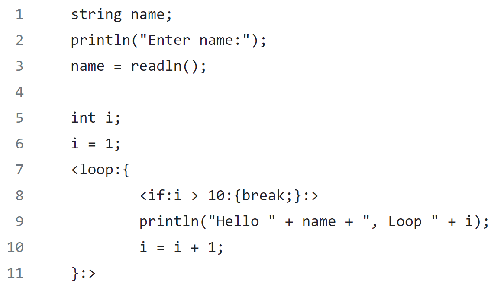
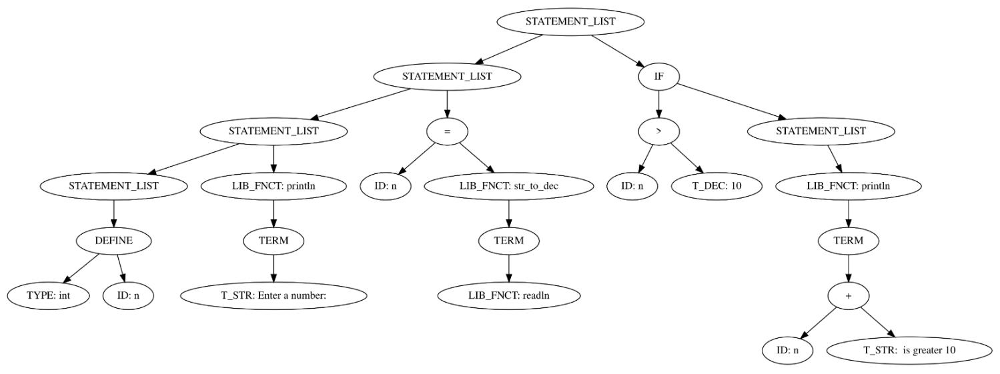

# Compiler Construction Project
fblocks represents a lightweight programming language.
This project provides an according interpreter written in C.

A lexer (Lex) creates tokens from the source code which are passed to the parser GNU Yacc/Bison.
The grammar of the language is defined in the [lang.y](fblocks/lang.y) file.
On program execution an abstract syntax tree is built and interpreded afterwards.

An overview of the programming language and the interpreter is given in the [documentation](dokumentation_fblocks.pdf).

## Syntax

## Abstract syntax tree

